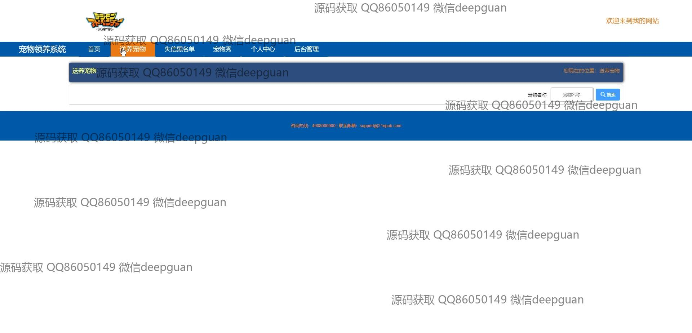
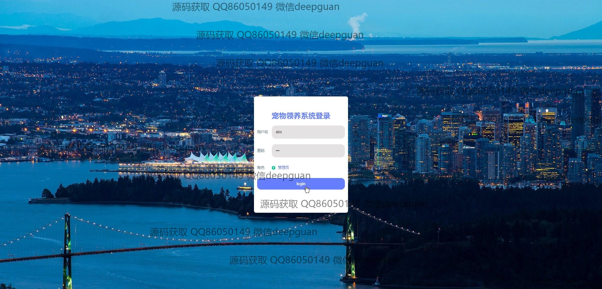

<h1 align="center">宠物领养系统+vue</h1>

## 简介
宠物领养系统：角色分为管理员、用户；主要功能包括用户管理、宠物管理、申请领养管理、失物招领管理和用户个人中心等。系统旨在提供便捷的宠物领养及信息管理流程。    --计算机毕业设计源码；毕设源码；java毕业设计源码

## 联系方式

<h3 align="center">获取完整代码与数据库文件 + 微信：deepguan QQ: 86050149 QQ群: 783742310</h3>

<h3 align="center">可帮忙远程部署 包运行成功！提供远程部署、修改代码、设计文档指导、代码讲解等服务！</h3>

## 功能介绍（完整见运行截图）
管理员：  
基本功能：登录、注册、退出系统。  
用户管理：查看、编辑、删除用户信息，包括账户、姓名、性别、联系方式等。  
宠物管理：添加、修改、删除宠物信息，支持上传宠物照片，管理宠物状态和审核信息。  
申请管理：管理领养申请，审核申请状态，查看申请者信息。  
系统设置：维护系统功能模块，管理黑名单及违规记录，支持文件上传与下载。  

用户：  
基本功能：登录、注册、退出系统。  
个人中心：编辑个人信息，包括姓名、性别、联系方式、上传头像等，修改密码，查看领养记录。  
领养宠物：浏览宠物信息，按名称搜索宠物，查看宠物详情，提交领养申请。  
互动模块：参与宠物展示和互动活动，查看失信黑名单信息，联系系统支持团队。

## 运行截图

本代码来源于网络,仅供学习参考使用!

